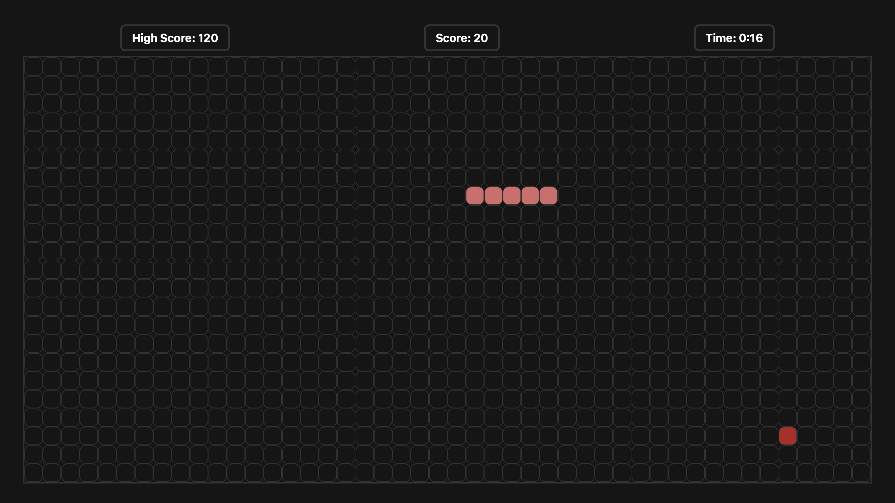

# 🐍 Snake Game (JavaScript)

A simple and interactive Snake Game built using **HTML, CSS, and JavaScript**.  
The game includes score tracking, high score storage, and a timer.

---

## 🚀 Features

- 🎮 Classic Snake gameplay
- 📈 Score and High Score tracking
- ⏱️ Timer functionality
- 🔄 Restart option after game over
- 🎨 Clean and responsive UI

---

## 📂 Project Structure
```
snake-game/
├── index.html
├── style.css
├── script.js
```
---

## 📸 Preview



---
## 🧠 How It Works

- The game board is dynamically created using JavaScript.
- Snake movement is controlled using keyboard inputs.
- Food appears randomly on the board.
- Score increases when the snake eats food.
- Game ends when the snake collides with itself or walls.

Example from HTML structure:  
:contentReference[oaicite:0]{index=0}

---

## 🛠️ Technologies Used

- HTML5
- CSS3
- JavaScript (Vanilla JS)

---

## ▶️ How to Run

1. Download or clone the repository
2. Open `index.html` in your browser

---

## 📌 Future Improvements

- Add difficulty levels
- Add sound effects
- Mobile controls support
- Multiplayer mode

---

## 👨‍💻 Author

Your Name
